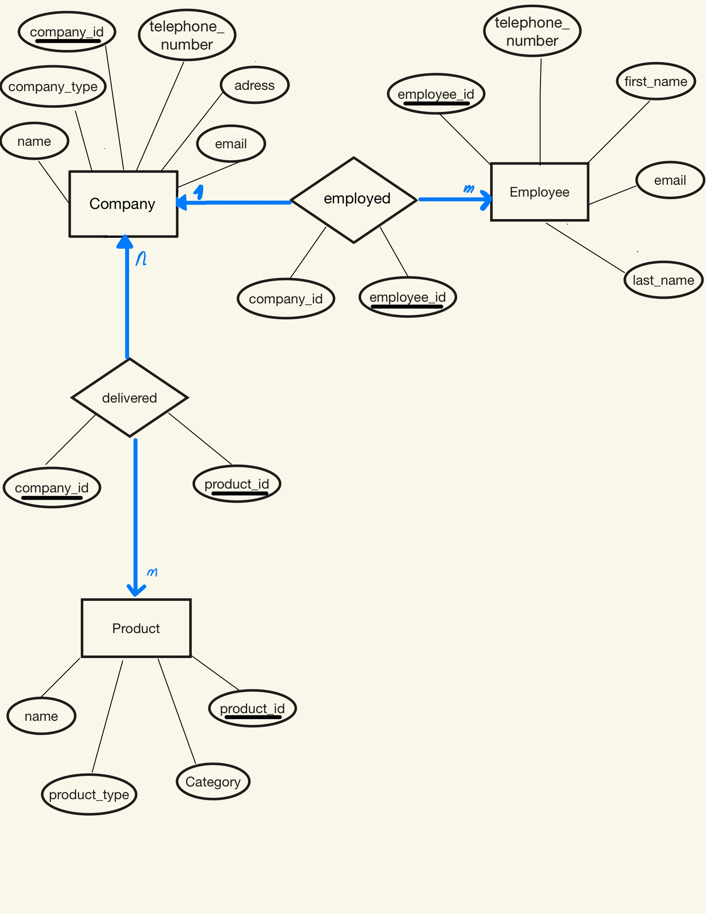

# Mini Project Migros

- Maryam Özdemir
  
## Projektidee

- Meine Streamlit-App ermöglicht die Verwaltung von Firmen, Mitarbeitenden und Produkten in einer PostgreSQL-Datenbank.
Die Daten werden über klar definierte Tabellen und Beziehungen (EMPLOYED für Anstellungen sowie DELIVERED für Lieferbeziehungen) strukturiert gespeichert und über SQL-Abfragen angezeigt sowie bearbeitet.
Damit wird die Datenkonsistenz durch Primärschlüssel, Fremdschlüssel und Constraints sichergestellt, während die Benutzeroberfläche die wichtigsten Funktionen übersichtlich in Tabs bereitstellt.

## ER Modell

## Entitätstypen

- **Company** *(company_id, name, company_type, email, telephone_number, address)*
- **Employee** *(employee_id, first_name, last_name, email, telephone_number)*
- **Product** *(product_id, name, category, product_type)*

## Beziehungstypen

### employed (Company – Employee)
- **Bedeutung:** Eine Firma beschäftigt Mitarbeitende.
- **Kardinalität:** 1 : n  
  *(eine Firma → viele Mitarbeitende; ein Mitarbeiter → genau eine Firma)*
- **Relationale Umsetzung:**  
  Zwischentabelle **EMPLOYED** *(employee_id als Primärschlüssel, company_id als Fremdschlüssel)*

### delivered (Company – Product)
- **Bedeutung:** Eine Firma liefert Produkte.
- **Kardinalität:** n : m  
  *(eine Firma → viele Produkte; ein Produkt → viele Firmen)*
- **Relationale Umsetzung:**  
  Zwischentabelle **DELIVERED** *(zusammengesetzter Primärschlüssel aus product_id und company_id)*

## Beschreibung der Streamlit-App

### 1. Eingabeformulare (was wird erfasst?)
Die App bietet für die drei Bereiche **Firmen**, **Mitarbeiter** und **Produkte** jeweils Formulare zur Datenerfassung an.  
- **Firmen:** company_id, name, company_type, email, telephone_number, address  
- **Mitarbeiter:** employee_id, company_id (Zuordnung zur Firma), first_name, last_name, email, telephone_number  
- **Produkte:** product_id, company_id (liefernde Firma), name, category, product_type  

Zusätzlich gibt es pro Bereich auch Formulare für **Update** (Datensätze bearbeiten) und Funktionen für **Delete** (Datensätze löschen).

### 2. Datenanzeige (welche Abfrage wird angezeigt?)
Die Daten werden in Tabellenform angezeigt und basieren auf SQL-SELECT-Abfragen:  
- **Firmen:** Anzeige aller Firmen aus `company`  
- **Mitarbeiter:** Anzeige der Mitarbeitenden inklusive Firmenname über JOIN von `employee`, `employed` und `company`  
- **Produkte:** Anzeige aller Produkte aus `product`  

Beim Löschen werden je nach Bereich zusätzlich abhängige Einträge entfernt (z.B. Beziehungen in `employed` oder `delivered`), damit die Daten konsistent bleiben.

## Auführen der App

**Wichtig:** Testet dass folgende Schritte funktionieren:
1. `pip install -r requirements.txt` (Muss nur einmal ausgeführt werden)
2. `python setup_db.py`
3. `streamlit run streamlit_app.py`

